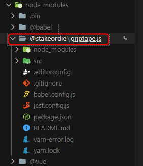
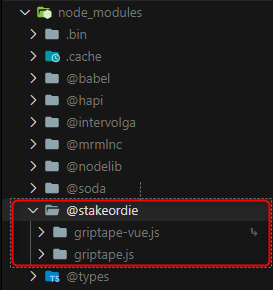
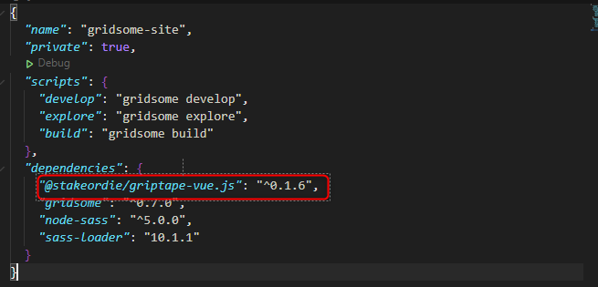

# Developers Guide

## Getting Started

### npm/yarn link process

#### About the process

In general, a package is simply a folder with code and a package.json file that describes the contents. When you want to use another package, you first need to add it to your dependencies. This means running `yarn add [package-name]` to install it into your project.

This will also update your package.json and your yarn.lock so that other developers working on the project will get the same dependencies as you when they run yarn or yarn install

When we would like to use a local package we can use "link" to test our application and use it in another project, basically work with resources for another code, for example, a component, plugin, etc. We can be able to work this in two different ways, locally or globally. 

If we want to work globally,  you have to publish your package in NPM. Or download a package that currently is upload.

#### Local

##### Link

In the project that we can create a link to be accessible for another project, we use the next command.

```bash
yarn link
```

To add de link that previously we created, we write this command in your terminal in the project that we want to work on.

```bash
yarn link [package-name]
```

This is going to create a copy in our "node modules" that we are importing where we can access the resources.

# Example Link

***linking two differents projects in a new one.***

```bash
yarn link @stakeordie/griptape.js
```



griptape-vue

```bash
yarn link @stakeordie/griptape-vue.js
```



new project

**IMPORTANT**

Before linking a dependency in your new project make sure to first run your dependencies with `yarn` or `npm i`.

## Unlink

---

Delete link in the current project

```bash
yarn unlink
```

Delete link package

```bash
yarn unlink [package-name]
```

***Examples unlinking two differentes projects in a new one.***

```bash
yarn unlink @stakeordie/griptape.js
```

```bash
yarn unlink @stakeordie/griptape-vue.js
```

This commands are going to remove our dependency from our ***node_modules*** folder.

# Install Globally From NPM

---

```bash
yarn add package-name
```

Or

```bash
yarn add package-name@1.2.3
```

This is going to incorporate a new dependency in our project. And we can validate this in our package.json file, similar to this:



After that, we are going to run `yarn` command once again, to incorporate the new packages and do them accessible in our project.

```bash
yarn
```

Good, now you are able to use dependencies, resources, or files from another project globally.

# Exporting and Importing Resources

You can import and exports many reources as you want, like folders, components, styles, etc. as long as they are available in your source project.

# Export

---

```jsx
import {YourResource} from 'routepath';

export {
	YourResource
}
```

# Import

---

```jsx
import {ResourceExample} from '[package-name]';
```
